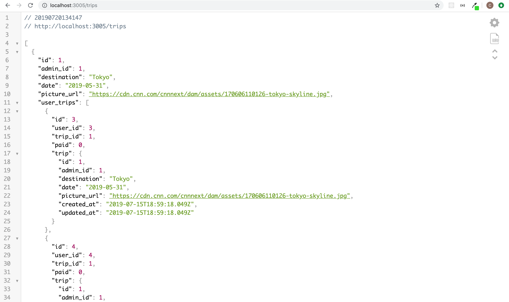

# Let's Go!
Let's Go! is a Group Trip Budgeting and Planning Application for friends who are want to plan and budget a trip together built using React.js + Redux on the [Frontend](https://github.com/cStruong/letsgo_front) with a Ruby on Rails backend API.

## Introduction
Let's Go! is my Capstone Project inspired to solve a problem me and my friends had while planning a group trip. We originally used a spreadsheet to plan a trip but quickly found it to be difficult and tedious. I created Let's Go to be a platform where individuals can plan and budget a trip together.

## Table of Contents
1. [Technologies](#technologies)
2. [Setup](#setup)
3. [Site](#site)

## Technologies<a name="technologies"></a>
This project is created using: 
* [Ruby on Rails](https://rubyonrails.org/) - a Ruby framework which is used to build the API to store user data via PosgreSQL.
* [bcrypt](https://www.npmjs.com/package/bcrypt) Gem - a Ruby gem used for password salting.
* [httparty](https://github.com/jnunemaker/httparty) Gem - a Ruby gem used for getting information from external web-based APIs.
* [Yelp Fusion API v3](https://www.yelp.com/developers/documentation/v3)

## Setup / Startup (locally) <a name="setup"></a>
To run this project locally, while in the project directory run (make sure PosgreSQL is running)
```
gem install
```
then
```
rails db:create && rails db:migrate && rails db:seed
```
to finally start the server
 ```
rails s -p 3005
```

## Site <a name="site"></a>
### Example API page

